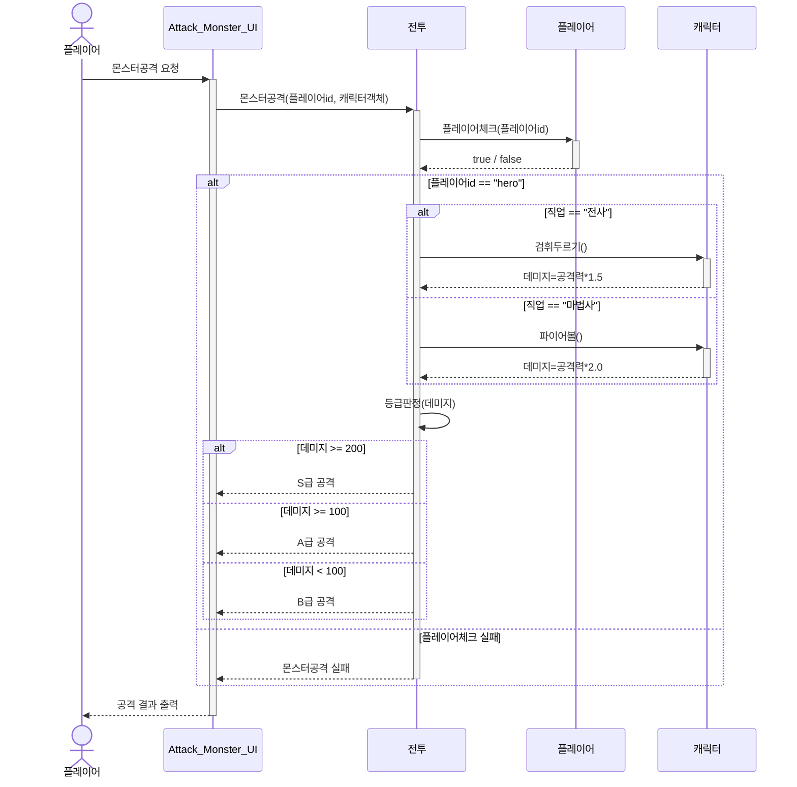

```mermaid
sequenceDiagram
    actor 플레이어
    participant Attack_Monster_UI
    participant 전투
    participant 플레이어객체 as 플레이어
    participant 캐릭터

    플레이어 ->>+ Attack_Monster_UI: 몬스터공격 요청
    Attack_Monster_UI ->>+ 전투: 몬스터공격(플레이어id, 캐릭터객체)

    전투 ->>+ 플레이어객체: 플레이어체크(플레이어id)
    플레이어객체 -->>- 전투: true / false

    alt 플레이어id == "hero"
        alt 직업 == "전사"
            전투 ->>+ 캐릭터: 검휘두르기()
            캐릭터 -->>- 전투: 데미지=공격력*1.5
        else 직업 == "마법사"
            전투 ->>+ 캐릭터: 파이어볼()
            캐릭터 -->>- 전투: 데미지=공격력*2.0
        end

        전투 ->> 전투: 등급판정(데미지)

        alt 데미지 >= 200
            전투 -->> Attack_Monster_UI: S급 공격
        else 데미지 >= 100
            전투 -->> Attack_Monster_UI: A급 공격
        else 데미지 < 100
            전투 -->> Attack_Monster_UI: B급 공격
        end
    else 플레이어체크 실패
        전투 -->>- Attack_Monster_UI: 몬스터공격 실패
    end

    Attack_Monster_UI -->>- 플레이어: 공격 결과 출력
```
